# FAZ + FortiMail Workspace: Integración Completa

Este caso de uso cubre la integración end-to-end entre **FortiMail Workspace** y **FortiAnalyzer 8.0** para centralizar la visibilidad del correo electrónico, detectar amenazas y generar reportes automatizados.

---

## Arquitectura General

```
FortiMail Workspace (cloud)
        │
        │  CEF Syslog UDP/514
        ▼
  FortiAnalyzer 8.0
  ├── Log Parser (normalización CEF → campos estándar)
  ├── Custom Views (triage rápido)
  ├── Event Handlers → Incidents (MAL / SPM)
  ├── Playbook automatizado (update de incidents)
  └── Reports (datasets + charts + template)
```

---

## Prerrequisitos

- Tenant de FortiMail Workspace con acceso administrador.
- FortiAnalyzer con IP pública y UDP/514 abierto desde la IP de egreso de FortiMail Workspace.
- Privilegios de administrador en FAZ (dispositivos, log parsers, event handlers, playbooks, reportes).
- **ADOM de tipo Syslog** habilitado en FAZ (recomendado).

---

## Paso 1: Reenvío de Logs desde FortiMail Workspace

FortiMail Workspace emite sus logs en formato **CEF (Common Event Format)** via Syslog UDP.

Ingresar a la consola de administración de FortiMail Workspace y navegar a:

**Settings → Account → Remote Logging**

Ingresar la IP pública del FortiAnalyzer como destino de los logs.

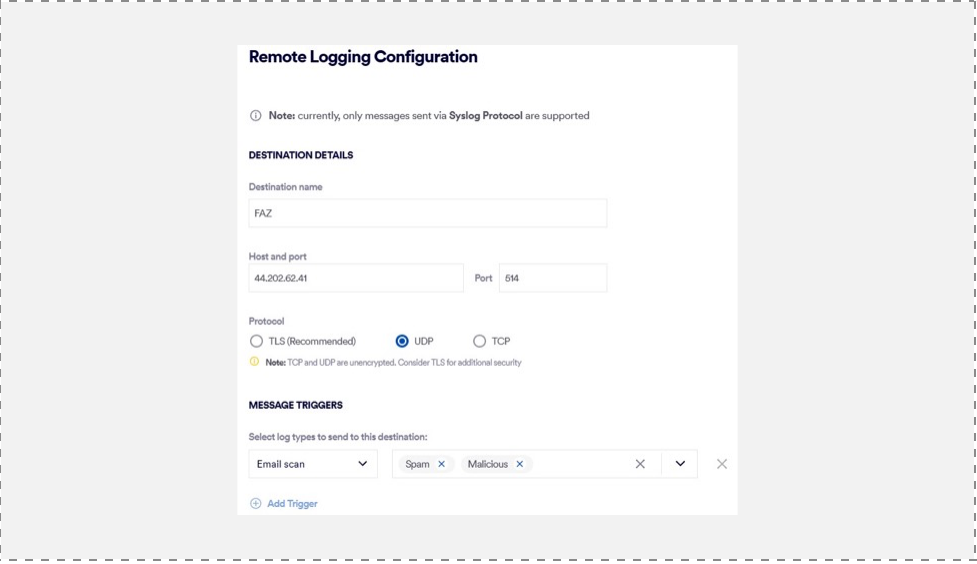

---

## Paso 2: Registrar el Dispositivo Syslog en FortiAnalyzer

Una vez que FortiMail Workspace comienza a enviar logs, FAZ los detecta como una fuente Syslog no autorizada.

En FortiAnalyzer navegar a **Device Manager** y aprobar la fuente Syslog proveniente de la IP de egreso de FortiMail Workspace.

> ⚠️ **Importante:** Si el dispositivo no aparece en Device Manager, habilitar un ADOM de tipo Syslog desde **System Settings → All ADOMs** y reintentar.

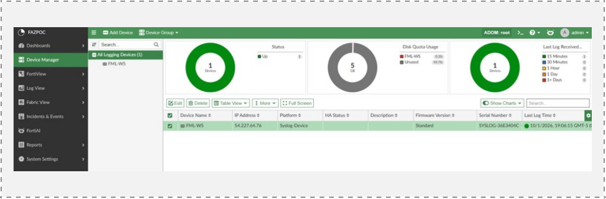

---

## Paso 3: Crear el Log Parser en FortiAnalyzer

FortiMail Workspace emite logs en CEF. Para mapear esos eventos al schema normalizado de FAZ se necesita un **Log Parser personalizado**.

Navegar a: **Incidents & Events → Log Parsers → Log Parsers → Create New**

Pegar el contenido del archivo [`log-parser/FortiMail_Workspace_Log_Parser.txt`](./log-parser/FortiMail_Workspace_Log_Parser.txt).

### Campos normalizados por el parser

| Campo FAZ | Campo CEF origen | Descripción |
|---|---|---|
| `mail_to` | `to` | Destinatario del correo |
| `mail_from` | `from` | Remitente del correo |
| `mail_subject` | `subject` | Asunto del correo |
| `src_ip` | `source_ip` | IP de origen del envío |
| `event_action` | `verdict` | Veredicto: MAL, SPM, etc. |
| `event_message` | `security_analysis` | Análisis de seguridad detallado |
| `event_subtype` | `scan_layers` | Capas de escaneo aplicadas |
| `src_domain` | `domain` | Dominio de origen |
| `data_sourcetype` | — | Fijo: `FortiMail Workspace` |

Una vez importado, verificar que el parser aparece en la lista:

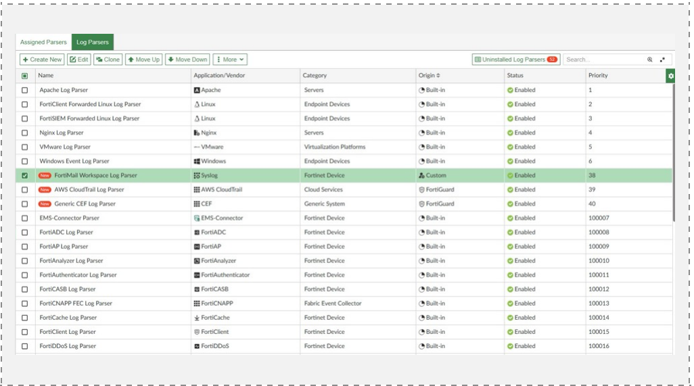

### Asignar el parser al dispositivo

Navegar a **Incidents & Events → Log Parsers → Assigned Parsers → Create New** y asignar el parser al dispositivo Syslog de FortiMail Workspace.

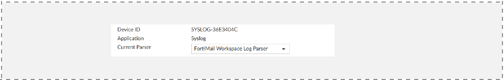

Validar el comportamiento del parser desde la misma sección, haciendo clic en la entrada del parser y revisando los campos parseados contra un log de muestra.

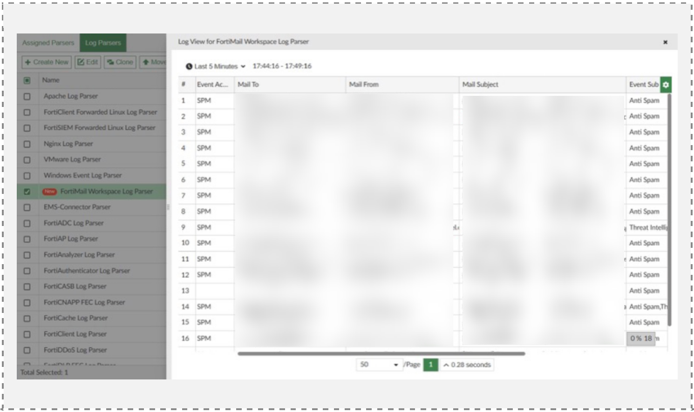
---

## Paso 4: Custom Views — Visualización de Logs

Las Custom Views permiten crear dashboards de acceso rápido para el triage de actividad de email security.

Navegar a: **Log View → Logs → All → Create Custom View**

### Vista general (todos los eventos)

**Filtro:**
```
data_sourceid = SYSLOG-<ID_DEL_DISPOSITIVO>
```

**Campos:**

| Campo | Descripción |
|---|---|
| Date/Time | Fecha y hora del evento |
| Event Action | Veredicto (MAL, SPM, CLEAN, etc.) |
| Mail From | Remitente del correo |
| Mail To | Destinatario del correo |
| Mail Subject | Asunto del mensaje |
| Source IP | IP de origen del envío |
| Event Sub Type | Capas de escaneo aplicadas |
| Event Message | Análisis de seguridad detallado |

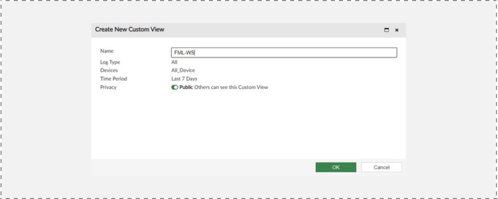

### Vistas adicionales (spam y malicioso)

Crear vistas separadas para aislar el tráfico por veredicto:

**Filtro spam:**
```
data_sourceid = SYSLOG-<ID>   AND   event_action = "SPM"
```

**Filtro malicioso:**
```
data_sourceid = SYSLOG-<ID>   AND   event_action = "MAL"
```

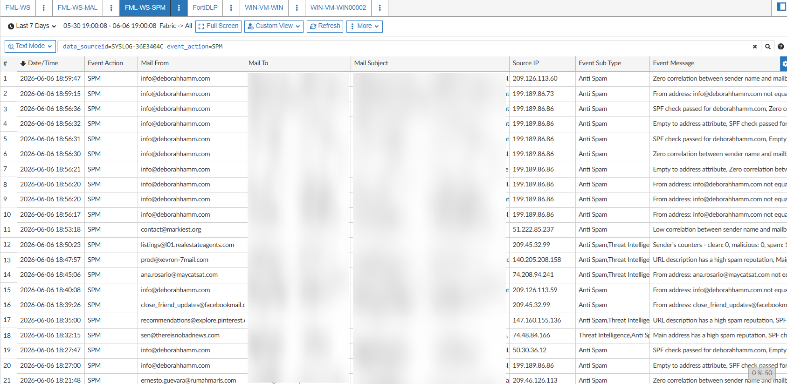

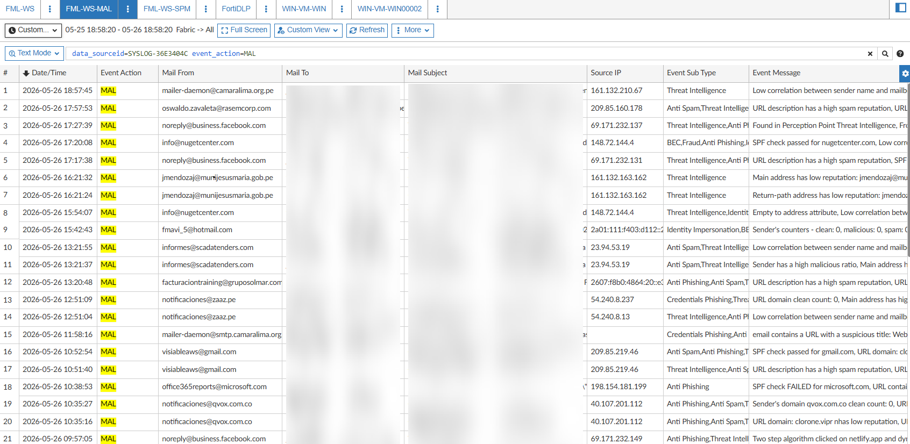
---

## Paso 5: Event Handlers e Incidents

Los Event Handlers convierten los logs en eventos accionables. Se crean dos handlers: uno para correo malicioso (MAL) y otro para spam (SPM).

Navegar a: **Incidents & Events → Event Handlers → Event Handlers → Create New**

---

### Handler: FMLWS_MAL (correo malicioso)

Este handler agrupa tres reglas para separar malware delivery de phishing de tarjetas de crédito.

**Regla 1 — FMLWS_MAL_MALWARE**

| Campo | Valor |
|---|---|
| Severidad | Critical |
| Log Device Type | Fabric |
| Log Type | Normalized Log |
| Log Field (agrupación) | Mail To (`mail_to`) |
| Filtro | `event_action="MAL" and event_subtype ~ "Malware"` |
| Event Message | `FML WS \| event_action: ${event_action} \| src_ip: ${src_ip} \| event_subtype: ${event_subtype}` |
| Tags | IP, Email |
| Indicador | Source IP (`src_ip`) — tipo IP |

**Regla 2 — FMLWS_MAL_CREDITCARDPHISHING**

| Campo | Valor |
|---|---|
| Severidad | Critical |
| Filtro | `event_action="MAL" and event_subtype ~ "Credit Card Phishing"` |
| Tags | IP, Email |
| Indicador | Source IP (`src_ip`) — tipo IP |

**Regla 3 — FMLWS_MAL (genérico)**

| Campo | Valor |
|---|---|
| Severidad | High |
| Filtro | `event_action="MAL"` |
| Tags | IP, Email |
| Indicador | Source IP (`src_ip`) — tipo IP |

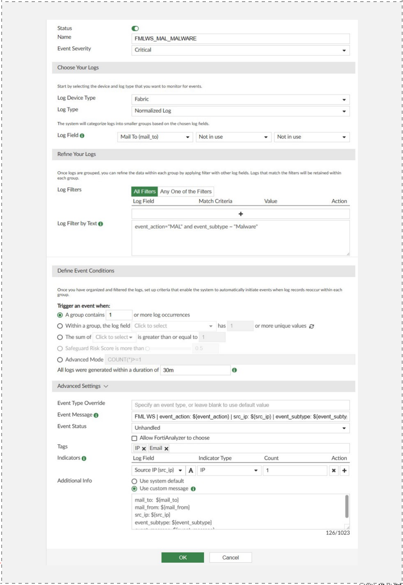

**Metadata del handler FMLWS_MAL:**

| Campo | Valor |
|---|---|
| Nombre | FMLWS_MAL |
| MITRE Tech ID | T1598 — Phishing for Information |
| Auto-crear Incident | Habilitado |

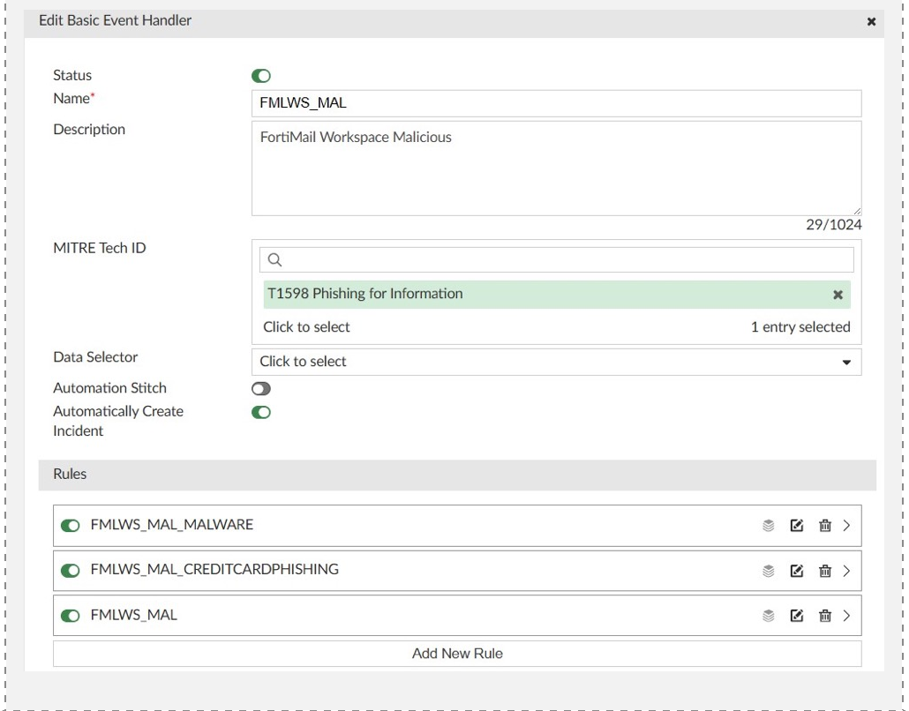

---

### Handler: FMLWS_SPM (spam)

Crear un segundo handler desde: **Incidents & Events → Event Handlers → Create New**

| Campo | Valor |
|---|---|
| Nombre | FMLWS_SPM |
| Severidad | Medium |
| Log Device Type | Fabric |
| Log Type | Normalized Log |
| Log Field (agrupación) | Mail To (`mail_to`) |
| Filtro | `event_action="SPM"` |
| Event Message | `FML WS \| event_action: ${event_action} \| src_ip: ${src_ip} \| event_subtype: ${event_subtype}` |
| Tags | IP, Email |
| Indicador | Source IP (`src_ip`) — tipo IP |

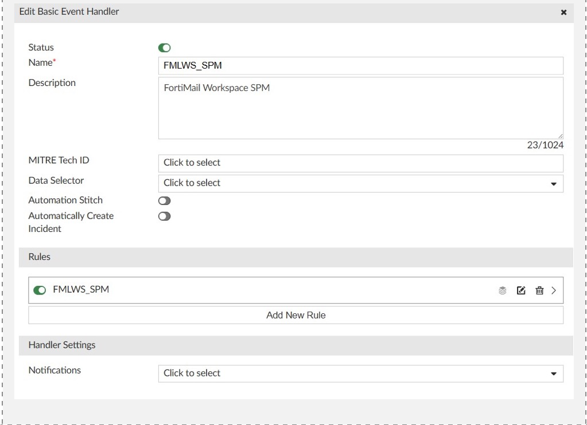

Al finalizar, ambos handlers deben aparecer en la lista:

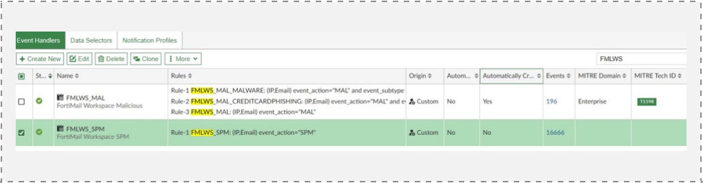

---

### Revisión de eventos e incidents

**Ver eventos disparados:**

Navegar a **Incidents & Events → Event Monitor → Explorer** y filtrar por `event_action: SPM` o `event_action: MAL`.

En **All Events** se puede guardar una Custom View con el filtro:
```
triggername="FMLWS_SPM" OR triggername="FMLWS_MAL"
```

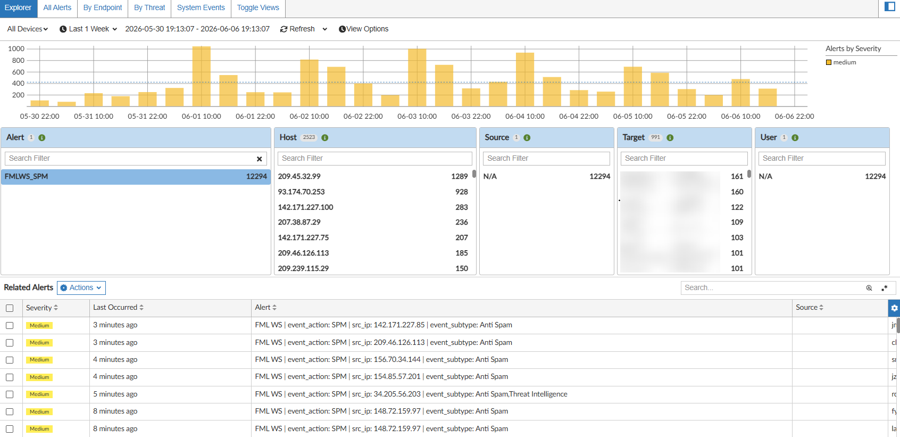

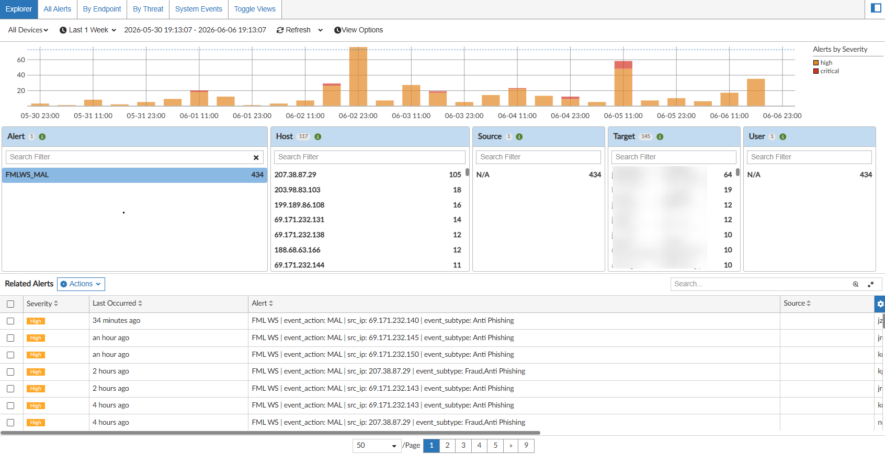

**Incidents auto-creados:**

Navegar a **Incidents & Events → Incidents → Incidents** para revisar los incidents creados automáticamente por el handler FMLWS_MAL.

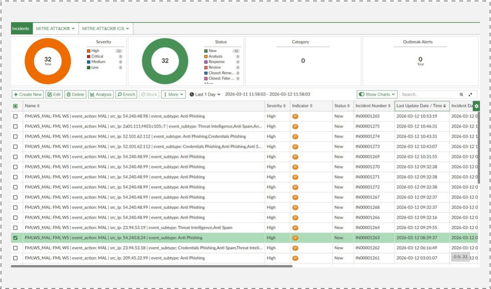

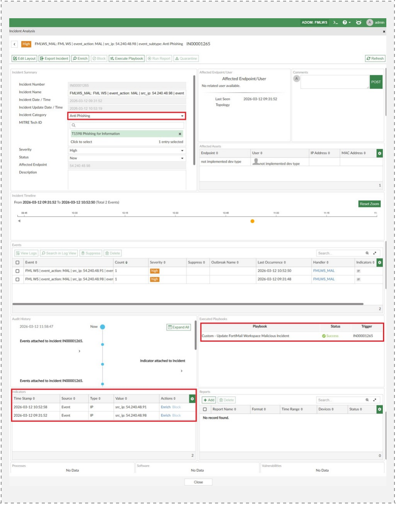

Desde la vista de detalle del incident se puede hacer **Enrich** sobre el indicador (IP de origen) para pivotear contra feeds de threat intelligence.

**Indicadores:**

Navegar a **Incidents & Events → Incidents → Indicators** para ver todos los indicadores generados.

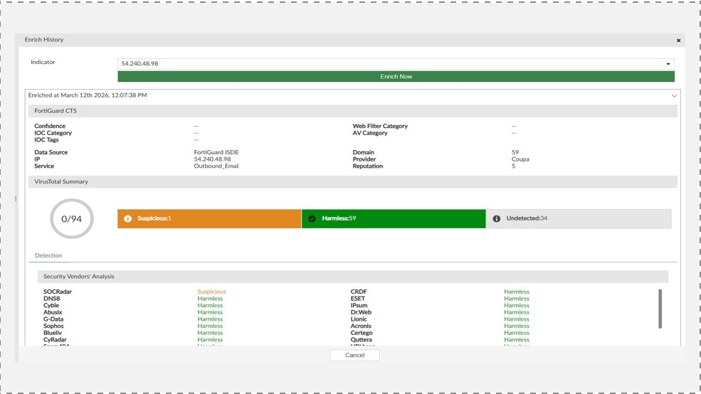

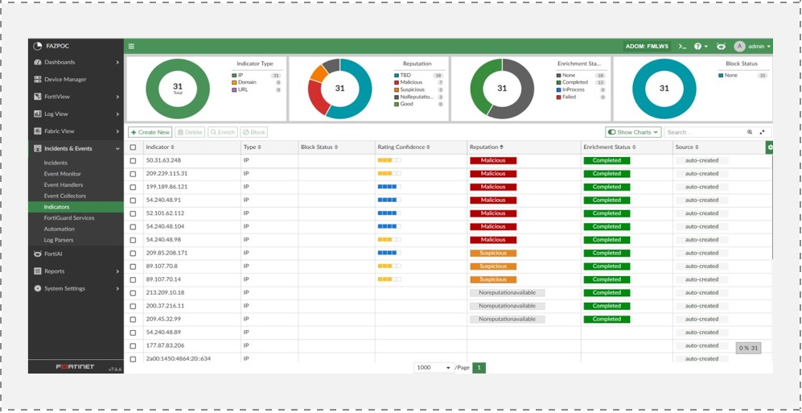

---

## Paso 6: Playbook Automatizado

Un playbook automatizado actualiza y reclasifica los incidents generados por el handler FMLWS_MAL cuando las condiciones MITRE corresponden a phishing.

### Crear el playbook

Navegar a: **Incidents & Events → Automation → Create New → New Playbook (from scratch)**

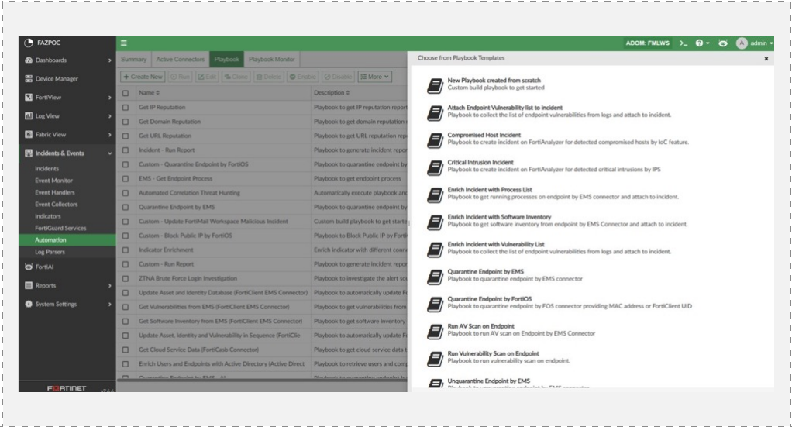

### Configurar el Trigger

Seleccionar **Incident_Trigger** y agregar las siguientes condiciones:

| Condición | Valor |
|---|---|
| Reporter | Contains: `Auto-Raised` |
| MITRE Domain | Contains: `Enterprise` |
| MITRE Tech ID | Contains: `T1598 Phishing for Information` |

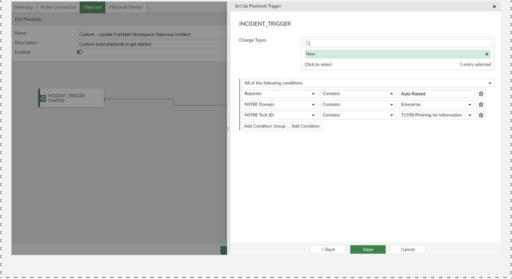

### Configurar la acción

Agregar un paso con el **Local Connector** (el propio FortiAnalyzer) y la acción **Update Incident**.

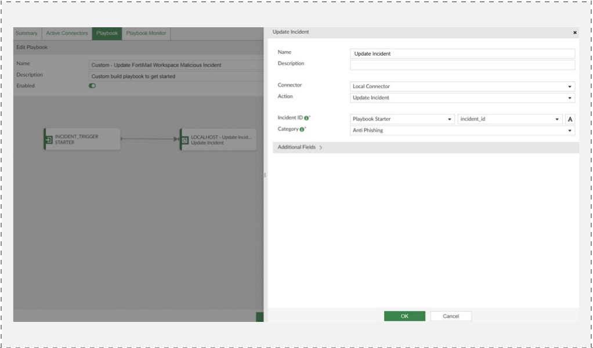

---

## Paso 7: Creación de Reportes

Los reportes requieren tres bloques: **datasets** (consultas SQL), **charts** (visualizaciones) y un **template** (layout del reporte).

### 7.1 Datasets

Navegar a: **Reports → Report Definition → Datasets → Create New**

Para cada dataset usar los siguientes parámetros:
- **Log Type:** Normalized
- **Query:** ver SQL de cada dataset abajo

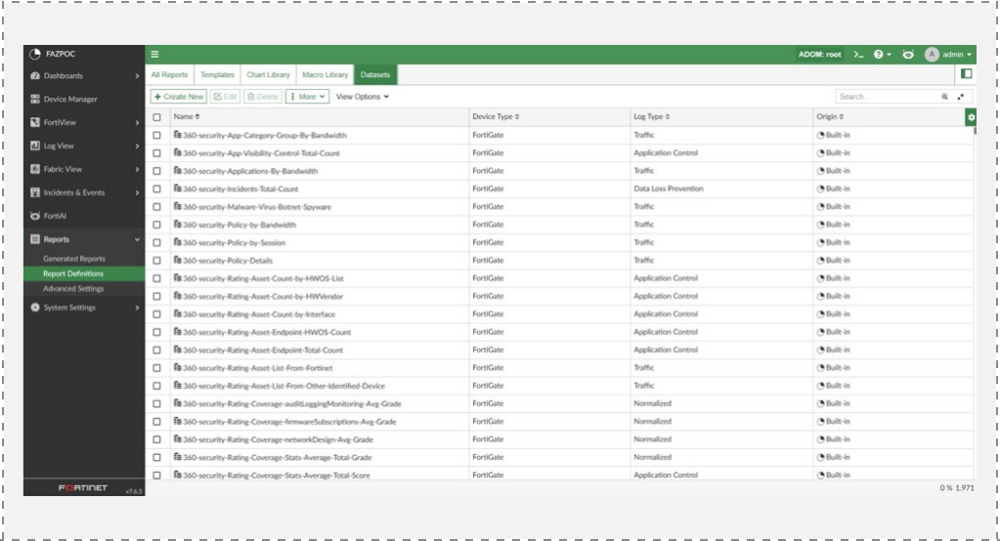

**Lista completa de datasets:**

---

**FortiMail Workspace — Daily Security Event Summary MAL**
```sql
SELECT $day_of_week as day,
       count(*) as total_events
FROM $log
WHERE $filter AND event_action = 'MAL'
GROUP BY day
ORDER BY total_events DESC
```

**FortiMail Workspace — Daily Security Event Summary SPM**
```sql
SELECT $day_of_week as day,
       count(*) as total_events
FROM $log
WHERE $filter AND event_action = 'SPM'
GROUP BY day
ORDER BY total_events DESC
```

**FortiMail Workspace — High-Risk Sender-Recipient**
```sql
SELECT mail_from, mail_to, count(*) as volume
FROM $log
WHERE $filter AND event_action = 'MAL'
GROUP BY mail_from, mail_to
ORDER BY volume DESC
```

**FortiMail Workspace — Hourly Threat Distribution MAL**
```sql
SELECT $hour_of_day as hour_marker,
       count(*) as total_threats
FROM $log
WHERE $filter AND (event_action = 'MAL')
GROUP BY hour_marker
ORDER BY hour_marker ASC
```

**FortiMail Workspace — Most Targeted Users MAL**
```sql
SELECT mail_to,
       count(*) as total_count
FROM $log
WHERE $filter AND event_action = 'MAL'
GROUP BY mail_to
ORDER BY total_count DESC
```

**FortiMail Workspace — Most Targeted Users SPM**
```sql
SELECT mail_to,
       count(*) as total_count
FROM $log
WHERE $filter AND event_action = 'SPM'
GROUP BY mail_to
ORDER BY total_count DESC
```

**FortiMail Workspace — Suspicious Subject MAL**
```sql
SELECT mail_subject, count(*) as occurrence
FROM $log
WHERE $filter AND event_action = 'MAL' AND mail_subject IS NOT NULL
GROUP BY mail_subject
ORDER BY occurrence DESC
```

**FortiMail Workspace — Suspicious Subject SPM**
```sql
SELECT mail_subject, count(*) as occurrence
FROM $log
WHERE $filter AND event_action = 'SPM' AND mail_subject IS NOT NULL
GROUP BY mail_subject
ORDER BY occurrence DESC
```

**FortiMail Workspace — Top Sender MAL**
```sql
SELECT mail_from,
       count(*) as total_count
FROM $log
WHERE $filter AND event_action = 'MAL'
GROUP BY mail_from
ORDER BY total_count DESC
```

**FortiMail Workspace — Top Sender SPM**
```sql
SELECT mail_from,
       count(*) as total_count
FROM $log
WHERE $filter AND event_action = 'SPM'
GROUP BY mail_from
ORDER BY total_count DESC
```

Una vez creados, todos los datasets deben aparecer en la lista:

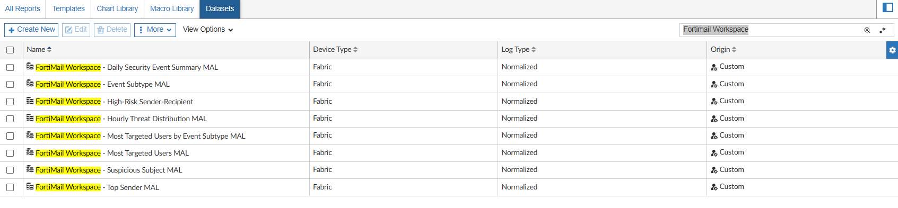

---

### 7.2 Charts

Navegar a: **Reports → Report Definition → Chart Library → Create New**

Crear un chart por cada dataset. Referencia visual de cada chart:

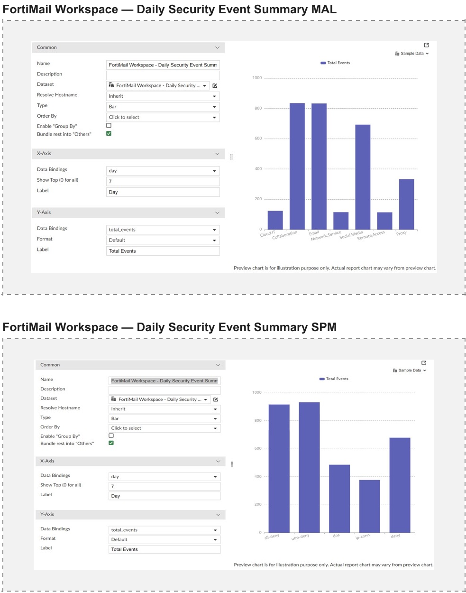

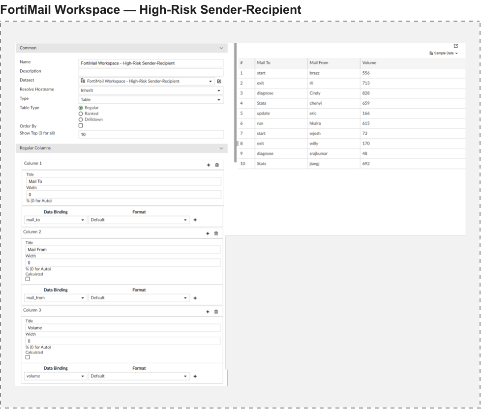

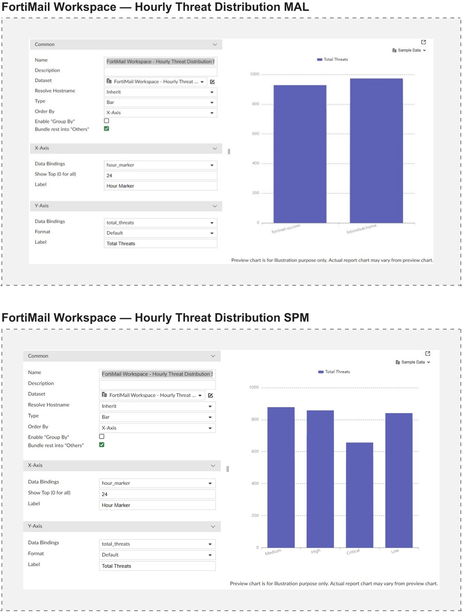

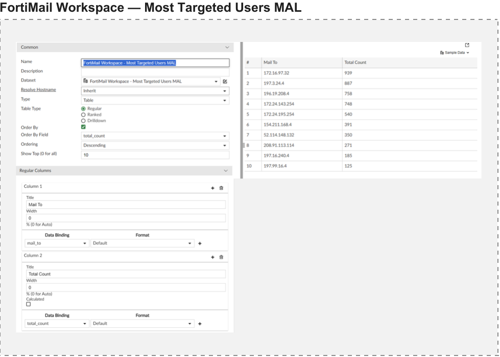

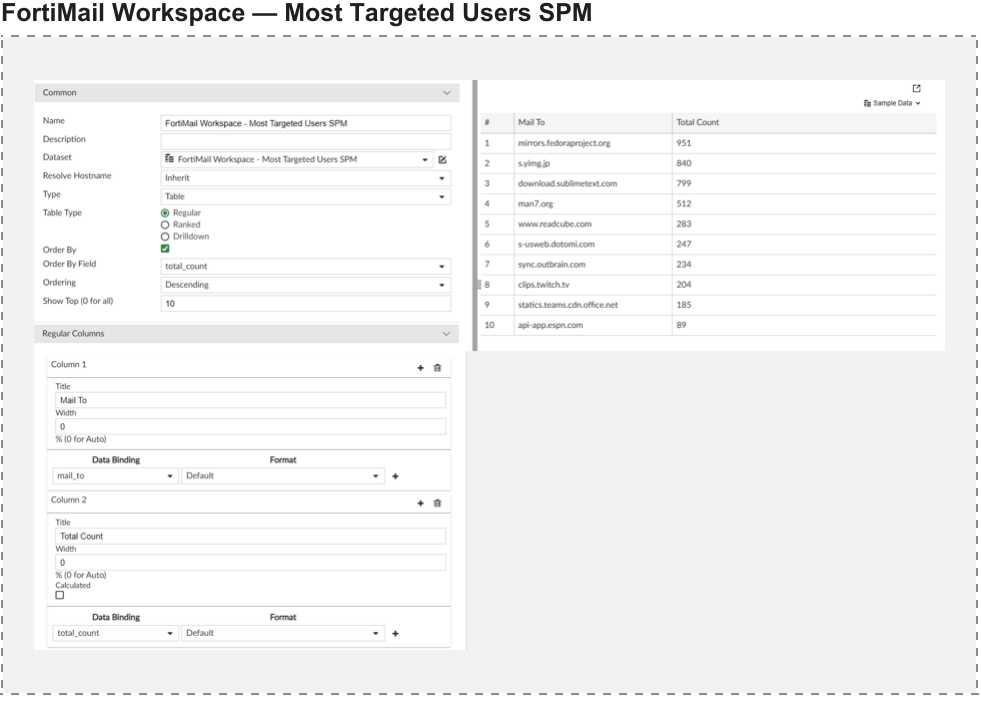

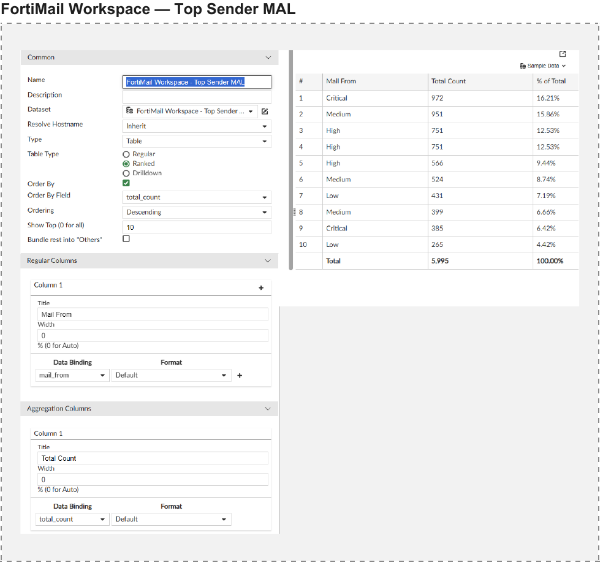

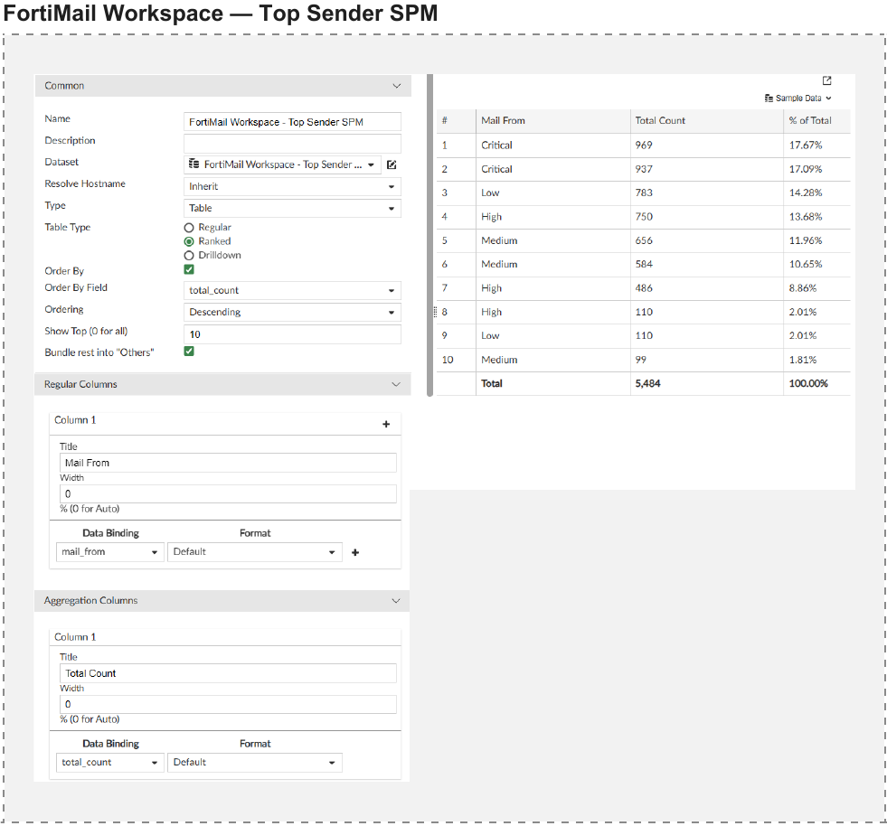

Una vez creados, todos los Chart deben aparecer en la lista:

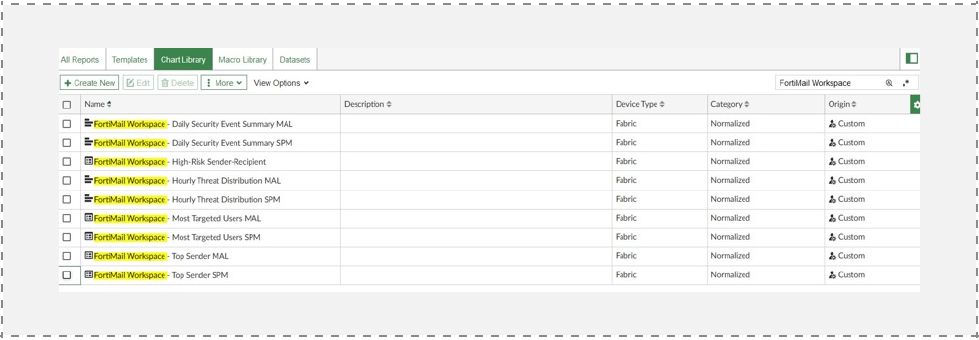
---

### 7.3 Template

Navegar a: **Reports → Report Definition → Template → Create New**

| Campo | Valor |
|---|---|
| Nombre | Template - FortiMail Workspace Report |
| Descripción | Present a FortiMail Workspace Report over a 7 day period. |

Insertar los charts creados en el cuerpo del template con la siguiente estructura recomendada:

**Malicious Mail:**
- High-Risk Sender-Recipient — detecta si un remitente ataca persistentemente a un mismo destinatario.
- Top Malicious Senders — identifica las direcciones externas más activas en entregar adjuntos o links maliciosos.
- Most Targeted Users — rankea los usuarios internos que reciben más ataques.
- Hourly Threat Distribution — visualiza picos de actividad maliciosa durante el día.
- Daily Security Event Summary — volumen diario para detectar anomalías masivas.

**Spam Mail:**
- Top Spam Senders — direcciones más activas en spam.
- Most Targeted Users — usuarios internos más impactados por spam.
- Hourly Threat Distribution — picos de spam a lo largo del día.
- Daily Security Event Summary — volumen diario de spam.

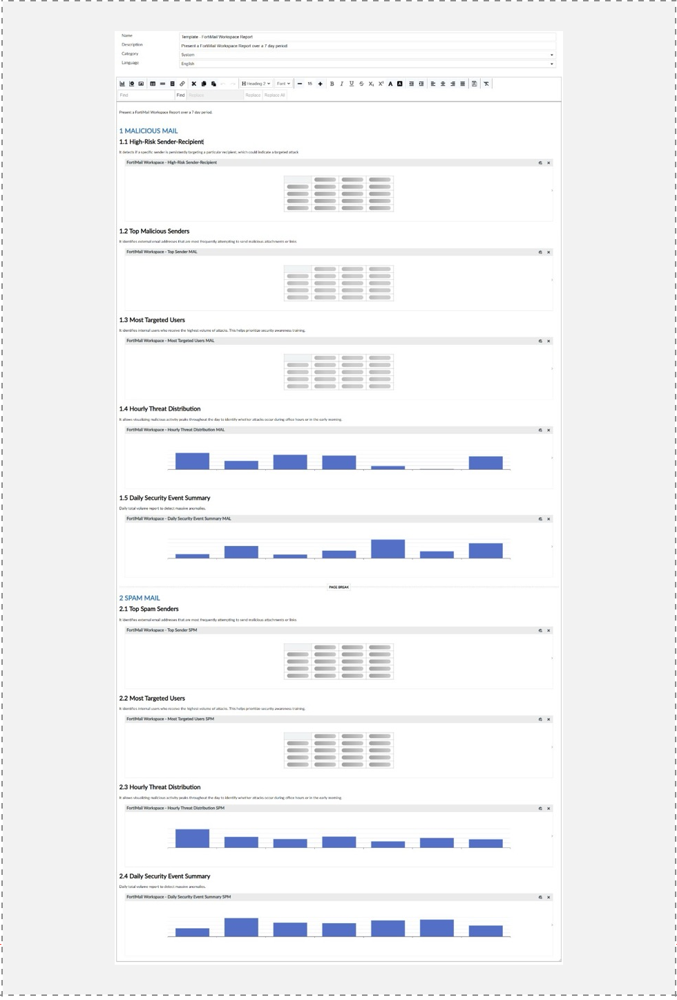

---

### 7.4 Generar el Reporte

Hacer clic derecho sobre el template y seleccionar **Create Report**.

En Settings configurar el rango de tiempo y seleccionar únicamente el dispositivo Syslog de FortiMail Workspace. Hacer clic en **Generate**.

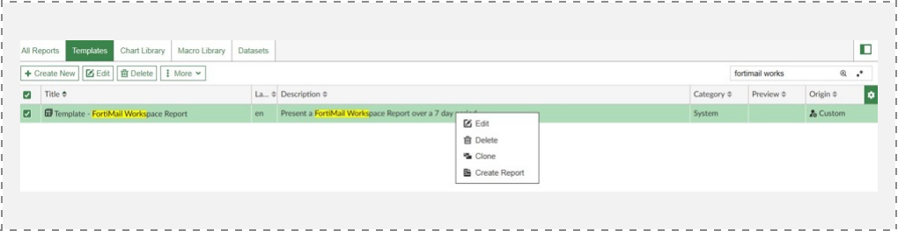

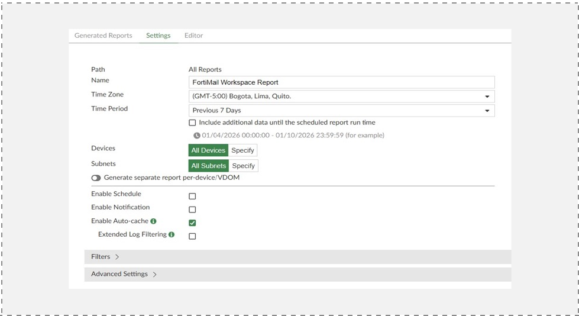

> ⚠️ Si el reporte generado aparece vacío, verificar que el rango de tiempo cubre períodos donde se recibieron logs de FortiMail Workspace y que el Log Parser asignado está activo en el dispositivo Syslog.

---

## Conclusión

Con esta integración, la telemetría de seguridad de email de FortiMail Workspace queda ingerida, normalizada, monitoreada y reportada en FortiAnalyzer. La configuración es modular: parsers, event handlers, playbooks, datasets y templates pueden extenderse para cubrir subcategorías adicionales de amenazas o requisitos específicos del negocio.
