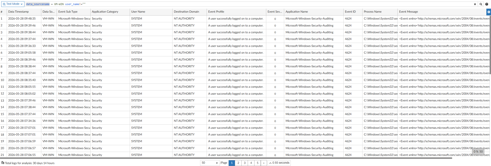
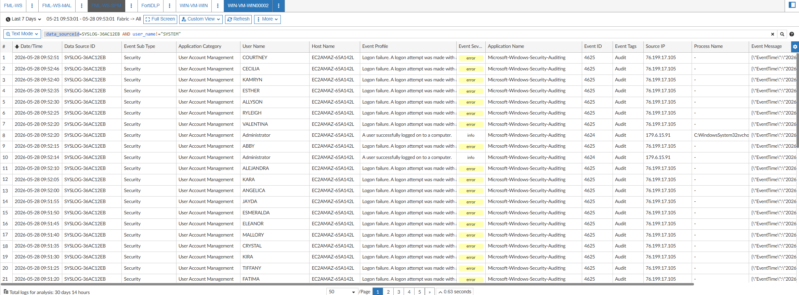

# FAZ + Windows Server: Reenvío de Logs y Detección de Amenazas

Este caso de uso cubre la integración completa entre **Windows Server 2025** y **FortiAnalyzer 8.0** para la detección de eventos de seguridad. El flujo tiene dos variantes según si el equipo Windows tiene **FortiClient** instalado o no.

---

## Arquitectura General

```
Windows Server 2025 (con FortiClient)
        │
        │  logs reenviados automáticamente (fct-forwarded-windows)
        ▼
  FortiAnalyzer 8.0
        ▲
        │  syslog UDP/514 (JSON via NXLog)
        │
Windows Server 2025 (sin FortiClient)
  └── NXLog instalado
```

---

## Paso 1: Reenvío de Logs desde Windows Server

### Opción A — El equipo tiene FortiClient instalado

Si el servidor ya cuenta con **FortiClient** (EMS o standalone), los logs de Windows **se reenvían automáticamente** al FortiAnalyzer sin ninguna configuración adicional en el equipo. FortiClient actúa como agente y etiqueta los logs con el tag `fct-forwarded-windows`, que el log parser identifica de forma nativa.

No se requiere instalar ningún software adicional.

### Opción B — El equipo NO tiene FortiClient (se instala NXLog)

Cuando el servidor Windows no tiene FortiClient, es necesario instalar **NXLog Community Edition** para capturar los eventos del Windows Event Log y reenviarlos al FortiAnalyzer via syslog UDP.

**Descarga:** https://nxlog.co/products/nxlog-community-edition/download

**Paso a paso:**

1. Descargar e instalar NXLog Community Edition en el servidor Windows.
2. El archivo de configuración principal se ubica en:
   ```
   C:\Program Files\nxlog\conf\nxlog.conf
   ```
3. Reemplazar el contenido del archivo con la configuración provista en este repositorio.
4. Editar la IP de destino en la sección `<Output out_fortianalyzer>` para apuntar a tu FortiAnalyzer:
   ```
   Host  <IP_DE_TU_FAZ>
   Port  514
   ```
5. Reiniciar el servicio NXLog:
   ```
   Restart-Service nxlog
   ```

Los Event IDs que captura esta configuración son:

| Event ID | Canal | Descripción |
|---|---|---|
| 4624 | Security | Inicio de sesión exitoso |
| 4625 | Security | Inicio de sesión fallido |
| 4688 | Security | Nuevo proceso creado |
| 4720 | Security | Cuenta de usuario creada |
| 4722 | Security | Cuenta de usuario habilitada |
| 4726 | Security | Cuenta de usuario eliminada |
| 4738 | Security | Cuenta de usuario modificada |
| 1102 | Security | Log de auditoría borrado |
| 7045 | System | Nuevo servicio instalado |

📁 Archivo de configuración: [`nxlog/nxlog.conf`](./nxlog/nxlog.conf)

---

## Paso 2: Importar el Log Parser en FortiAnalyzer

Para que FortiAnalyzer pueda interpretar y normalizar los logs enviados por NXLog (formato JSON via syslog), es necesario importar un **Log Parser** personalizado.

### Cómo importar el Log Parser

1. Ingresar al FortiAnalyzer con una cuenta administradora.
2. Navegar a: **Security Fabric → Log Parser**
3. Hacer clic en **Import** (ícono de nube/archivo).
4. Seleccionar el archivo `Windows Event Log Parser NXLog.txt` provisto en este repositorio.
5. Confirmar la importación. El parser aparecerá listado como:
   - **Nombre:** `Windows Event Log Parser NXLog`
   - **Categoría:** `Endpoint Devices`
   - **Aplicación:** `Windows`

El parser es capaz de identificar dos tipos de fuentes:
- Logs reenviados por FortiClient (tag `fct-forwarded-windows`)
- Logs enviados como syslog desde NXLog (formato JSON con campo `EventTime`)

📁 Archivo del parser: [`log-parser/Windows Event Log Parser NXLog.txt`](./log-parser/Windows%20Event%20Log%20Parser%20NXLog.txt)

---

## Paso 3: Crear Custom View en FortiAnalyzer

Una vez que los logs están llegando al FAZ, es recomendable crear una **Custom View** en el Log Viewer para visualizar solo los campos relevantes de Windows. El filtro y los campos difieren según el método de reenvío utilizado.

Navegar a: **Log View → SIEM → (seleccionar el ADOM) → Custom View → Create New**

---

### Custom View para FortiClient

Cuando los logs provienen de FortiClient, el identificador del equipo Windows se refleja en el campo `data_sourcename`.

**Filtro:**
```
data_sourcename = <NOMBRE_DEL_HOST>   AND   user_name != ""
```

**Campos a incluir en la vista:**

| Campo | Descripción |
|---|---|
| Data Timestamp | Fecha y hora del evento |
| Data Source Name | Nombre del host Windows (identificador del equipo) |
| Event Sub Type | Subtipo del evento (ej. Security) |
| Application Category | Categoría de la aplicación |
| User Name | Usuario involucrado en el evento |
| Destination Domain | Dominio de destino |
| Event Profile | Descripción legible del evento |
| Event Severity | Severidad del evento |
| Application Name | Nombre de la aplicación que generó el log |
| Event ID | ID del evento de Windows |
| Process Name | Nombre del proceso |
| Event Message | Mensaje XML completo del evento |
| Data Source Type | Tipo de fuente (Windows XML Event / Windows JSON Event) |



---

### Custom View para NXLog (Syslog)

Cuando los logs provienen de NXLog, el identificador del equipo Windows aparece en el campo `data_sourceid` con el prefijo `SYSLOG-`.

**Filtro:**
```
data_sourceId = SYSLOG-<ID>   AND   user_name != "SYSTEM"
```

> El filtro `user_name != "SYSTEM"` excluye el ruido generado por el sistema operativo y permite enfocarse en actividad de usuarios reales.

**Campos a incluir en la vista:**

| Campo | Descripción |
|---|---|
| Date/Time | Fecha y hora del evento |
| Data Source ID | Identificador SYSLOG del host Windows |
| Event Sub Type | Subtipo del evento (ej. Security) |
| Application Category | Categoría de la aplicación |
| User Name | Usuario involucrado en el evento |
| Host Name | Nombre del host de origen |
| Event Profile | Descripción legible del evento |
| Event Severity | Severidad del evento |
| Application Name | Nombre de la aplicación que generó el log |
| Event ID | ID del evento de Windows |
| Event Tags | Tags del evento (ej. Audit) |
| Source IP | IP de origen de la autenticación |
| Process Name | Nombre del proceso |
| Event Message | Mensaje JSON completo del evento |



---

## Paso 4: Crear los Event Handlers

Los **Event Handlers** en FortiAnalyzer son reglas de correlación y alerting que se disparan cuando se detectan patrones específicos en los logs. Se crean desde:

**FortiAnalyzer → Security Fabric → Event Handler**

### Cómo importar los Event Handlers

En lugar de crear cada handler manualmente, se puede importar el archivo de configuración directamente:

1. Ingresar a la CLI del FortiAnalyzer (SSH o consola).
2. Ejecutar:
   ```
   config alert basic-handler
   ```
3. Pegar el contenido del archivo [`event-handlers/WIN-LOG-Evasion and 2 more.conf`](./event-handlers/WIN-LOG-Evasion%20and%202%20more.conf).

### Los 3 Event Handlers

---

#### Handler 1: WIN-LOG-Auth-BruteForce

Detecta intentos de fuerza bruta en autenticación Windows.

- **MITRE ATT&CK:** T1078, T1110, T1110.001, T1110.003
- **Severidad:** Medium
- **Regla:** Event ID `4625` (logon fallido) ≥ 5 veces agrupadas por `user_name` y `src_ip` en 1 minuto
- **Indicador de compromiso:** `src_ip` (tipo IP)

---

#### Handler 2: WIN-LOG-Account-Manipulation

Detecta creación, habilitación, modificación y eliminación de cuentas de usuario.

- **MITRE ATT&CK:** T1136, T1098
- **Severidad:** Medium
- **Reglas:**

| Regla | Event ID | Descripción |
|---|---|---|
| SYSLOG-WIN-Account-Manipulation eventid 4720 | 4720 | Cuenta creada |
| SYSLOG-WIN-Account-Manipulation eventid 4722 | 4722 | Cuenta habilitada |
| SYSLOG-WIN-Account-Manipulation eventid 4738 | 4738 | Cuenta modificada |
| SYSLOG-WIN-Account-Manipulation eventid 4726 | 4726 | Cuenta eliminada |

---

#### Handler 3: WIN-LOG-Evasion

Detecta técnicas de evasión y Living off the Land (LotL).

- **MITRE ATT&CK:** T1543.003, T1070.001
- **Severidad:** High
- **Regla:** Cualquiera de los siguientes eventos:
  - Event ID `1102` — Log de auditoría borrado
  - Event ID `7045` — Nuevo servicio instalado
  - Event ID `4688` con `process_name` que contenga `powershell.exe`

---

📁 Archivo de handlers: [`event-handlers/WIN-LOG-Evasion and 2 more.conf`](./event-handlers/WIN-LOG-Evasion%20and%202%20more.conf)

---

## Paso 5: Probar los Event Handlers con PowerShell

Para validar que los event handlers están funcionando correctamente, se incluyen scripts de PowerShell que generan los eventos de Windows correspondientes en un entorno de prueba.

> ⚠️ **Advertencia:** Ejecutar estos scripts únicamente en entornos de laboratorio o pruebas controladas con Windows Server 2025. Algunos scripts modifican usuarios del sistema o borran logs de seguridad.

### Scripts disponibles

| Script | Handler que prueba | Eventos generados |
|---|---|---|
| [`WIN-Auth-BruteForce.ps1`](./powershell-tests/WIN-Auth-BruteForce.ps1) | WIN-LOG-Auth-BruteForce | 4625 (x6 intentos fallidos) |
| [`WIN-Account-Manipulation.ps1`](./powershell-tests/WIN-Account-Manipulation.ps1) | WIN-LOG-Account-Manipulation | 4720, 4722, 4738 |
| [`WIN-Evasion-And-LotL.ps1`](./powershell-tests/WIN-Evasion-And-LotL.ps1) | WIN-LOG-Evasion | 4688, 7045, 1102 |

### Cómo ejecutar los scripts

```powershell
# Abrir PowerShell como Administrador y ejecutar:
Set-ExecutionPolicy Bypass -Scope Process -Force
.\WIN-Auth-BruteForce.ps1
```

📁 Scripts de prueba: [`powershell-tests/`](./powershell-tests/)
